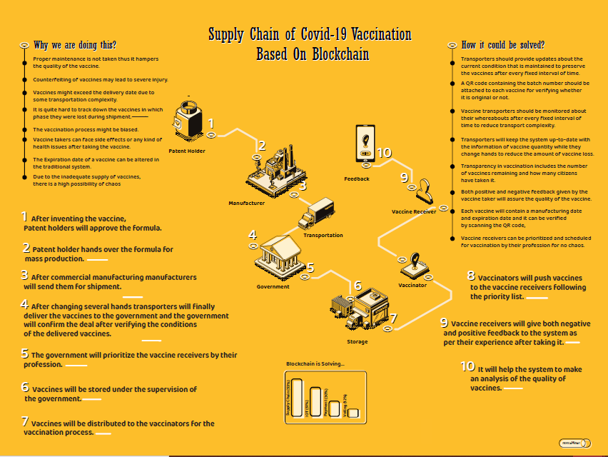

# A-blockchain-based-vaccine-supply-tracking-system
A blockchain based platform where all the information
related to the supply chain of the vaccines from manufacturing to distribution , this whole
process would be stored with a view to maintaining the quality of the vaccines and making the
entire process more transparent.

This project has been selected at Blockchain Olypiad 2021 as top 40 fonalist.

# Poster

